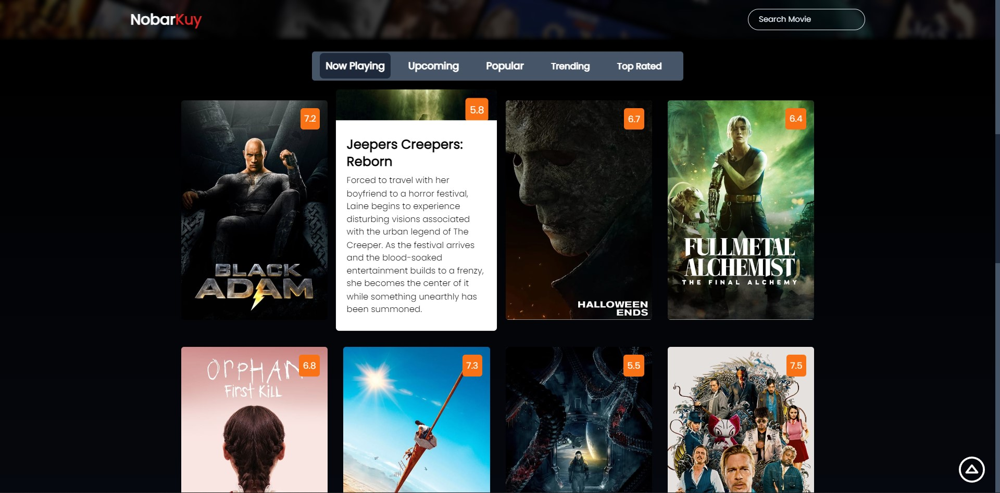

# NobarKuy

Submission Belajar Fundamental Front-End Web Development (Dicoding)

**CARA INSTALASI**

1.  Jalankan perintah

    npm install

2.  Menjalankan aplikasi menggunakan webpack production

    npm run build

3.  Atau menggunakan webpack development

    npm run start-dev

**KRITERIA SUBMISSION**

- [x] Menggunakan standar _ES6 sintaks_ dalam menuliskan kode _JavaScript_ pada proyek yang dibuat.
- [x] Terdapat minimal satu penerapan _custom element_.
- [x] Menggunakan _Webpack_ sebagai module bundler (tahap produksi).
- [x] Memanfaatkan _Webpack_ sebagai _environment_ dalam pengembangan proyek (tahap _development_).
- [x] Memanfaatkan API dengan menggunakan konsep _AJAX_ dalam menampilkan data yang dinamis pada aplikasi yang dibuat.
- [x] Anda bebas menentukkan tema aplikasi yang ingin dibuat, **terkecuali** tema _Club Finder/\_\_Pencarian Klub Olahraga_, _Sepak Bola_, atau _Dicoding Books_.

**PREVIEW PROJECT**

